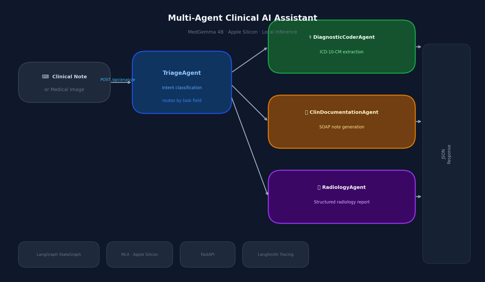
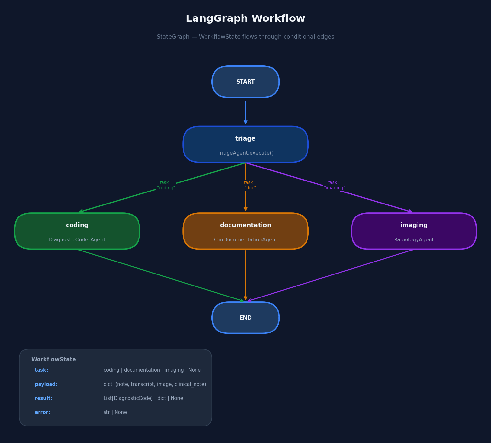
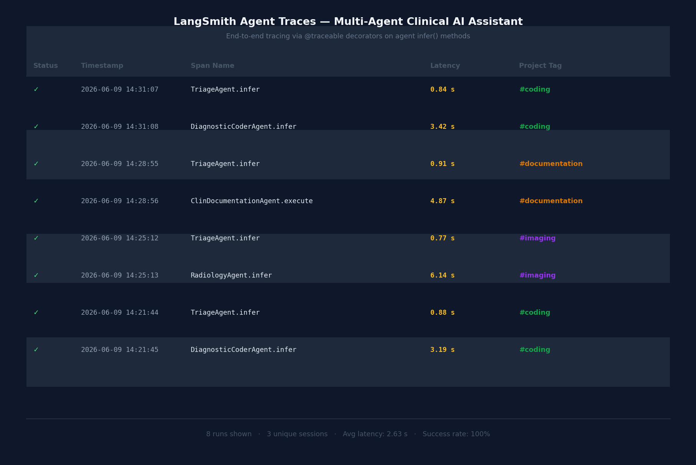

# Multi-Agent Clinical AI Assistant

A multi-agent AI system that triages clinical input and routes it to specialist agents for **ICD-10 coding**, **SOAP note generation**, and **radiology interpretation** — powered by MedGemma 4B running fully locally on Apple Silicon via MLX.



---

## Demo

https://github.com/user-attachments/assets/REPLACE_WITH_CDN_ID

> **How to get the embed link:** After pushing to GitHub, open any Issue → drag `artifacts/demo.mov` into the text box → copy the URL it generates (looks like `https://github.com/user-attachments/assets/xxxxxxxx`) → paste it above replacing `REPLACE_WITH_CDN_ID`.
> 
> Until then, [download the demo here](artifacts/demo.mov).

---

## How It Works

User input (clinical note, transcript, or medical image) enters a **triage agent** that classifies the intent and routes it to the appropriate specialist. Each specialist runs inference locally, parses structured output, and returns a typed API response.

```
Input
  └─► TriageAgent          classifies intent
        ├─► DiagnosticCoderAgent    extracts ICD-10-CM codes
        ├─► ClinicalDocumentationAgent  generates SOAP note
        └─► RadiologyAgent          interprets medical image
```



---

## Features

| Capability | Details |
|---|---|
| ICD-10 Extraction | Parses clinical notes and returns structured diagnostic codes |
| SOAP Note Generation | Converts doctor–patient transcripts into Subjective / Objective / Assessment / Plan |
| Radiology Interpretation | Accepts X-ray, MRI, CT images and returns a structured radiology report |
| Local Inference | MedGemma 4B 4-bit quantised — no data leaves the machine |
| Async API | `asyncio.to_thread` keeps the FastAPI event loop unblocked during inference |
| Thread-safe model loading | Double-checked locking singleton prevents concurrent cold-start races |
| PHI-safe logging | Logs metadata only — no clinical content is ever written to disk |
| LangSmith tracing | Optional end-to-end agent trace visibility |
| Evaluation | ICD-10 eval script with per-sample precision / recall / F1 against a 100-sample ground-truth dataset |
| Test suite | 59 tests across agents, API, transforms, and prompts |

---

## System Requirements

- macOS 14+ with Apple M-series chip (MLX requires Apple Silicon)
- Python 3.11 or 3.12
- ~3 GB disk for the quantised model (downloaded automatically on first run)
- HuggingFace account with MedGemma access (model is gated — [request access here](https://huggingface.co/google/medgemma-4b-it))

---

## Installation

```bash
# 1. Clone and enter the repo
git clone <your-repo-url>
cd ClinIQ

# 2. Create a virtual environment
python3.11 -m venv .venv
source .venv/bin/activate

# 3. Install dependencies
pip install -r requirements.txt
```

### Environment variables (optional)

Create a `.env` file in the project root:

```env
# HuggingFace — required if model download fails with a 401
HUGGINGFACE_TOKEN=hf_...

# LangSmith — optional, enables agent tracing
LANGCHAIN_API_KEY=ls_...
LANGCHAIN_TRACING_V2=true
LANGCHAIN_PROJECT=cliniq
```

---

## Running

```bash
uvicorn app.main:app --reload
```

Open [http://localhost:8000](http://localhost:8000).

The model downloads on the first request (~2.5 GB, once). Subsequent starts load from the HuggingFace cache in seconds.

---

## API

**`POST /api/analyze`** — multipart form

| Field | Type | Description |
|---|---|---|
| `note` | string (optional) | Clinical note or doctor–patient transcript |
| `image` | file (optional) | Medical image (PNG, JPEG) |

At least one field is required.

**Response shape varies by agent:**

```jsonc
// coding
{ "agent": "coding", "result": [{ "code": "J18.9", "description": "Pneumonia, unspecified" }] }

// documentation
{ "agent": "documentation", "result": { "Subjective": "...", "Objective": "...", "Assessment": "...", "Plan": "..." } }

// imaging
{ "agent": "imaging", "result": { "technique": "...", "findings": "...", "impression": "...", "recommendations": "...", "answer_to_user_question": null } }
```

---

## Testing

```bash
# Run full test suite (no model required — agents are mocked)
pytest
```

59 tests across four modules:

| Module | Tests | Coverage |
|---|---|---|
| `test_transforms` | 14 | JSON extraction, image decode, partial recovery |
| `test_prompts` | 16 | Prompt construction for all four agents |
| `test_agents` | 18 | Agent routing, parsing, error paths |
| `test_api` | 11 | Endpoint validation, response shapes, error codes |

---

## Evaluation

```bash
python -m evaluations.eval_icd10          # full 100-sample run
python -m evaluations.eval_icd10 --limit 10  # quick smoke test
```

Results on the included 100-sample synthetic ICD-10 dataset (MedGemma 4B 4-bit, Apple M-series, avg **3.1 s/sample**):

| Metric | Exact code match | 3-char category match |
|---|---|---|
| Macro precision | 0.180 | 0.360 |
| Macro recall | 0.180 | 0.360 |
| **Macro F1** | **0.180** | **0.360** |
| Exact match rate | 0.0% | — |

**Reading the numbers:** "Exact" requires the full code to match (e.g. `G43.909`). "Category" rolls codes up to their 3-character prefix (`G43`) — the standard relaxed metric used in the ICD-10 coding literature, since a 4B local model often lands in the right disease family but misses the specificity digits. The category-level F1 of **0.36** means the model identifies the correct disease categories in roughly 1 in 3 slots — reasonable for a 4-bit quantised 4B model running fully locally with no fine-tuning.

Per-sample results (precision, recall, F1, both metrics, latency) are saved to `evaluations/eval_results.json`.

---

## Monitoring

Agent traces are visible in LangSmith when `LANGCHAIN_API_KEY` is set.



---

## Project Structure

```
app/
  agents/        triage, coder, documenter, imaging — one file per agent
  api/           FastAPI router and Pydantic response schemas
  config/        AppConfig (model ID, env settings)
  graph/         LangGraph pipeline assembly and WorkflowState schema
  utils/         model registry, prompts, transforms, logger
  static/        single-page frontend (index.html)
  main.py

evaluations/     ICD-10 eval script + 100-sample dataset
tests/           pytest suite
```
